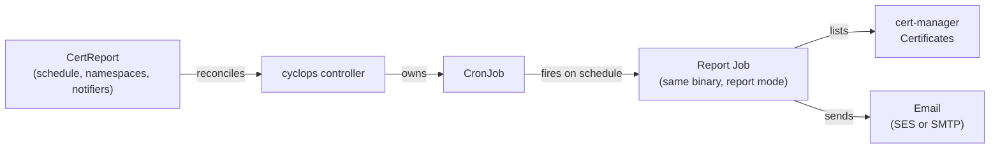

# cyclops

A Kubernetes controller that watches [cert-manager](https://cert-manager.io) `Certificate`
resources and emails a daily report of certificates that are expired, were never issued, or are
overdue for renewal (past the renewal time cert-manager set for them).

cert-manager renews certificates automatically. cyclops is the backstop for when that renewal
silently fails.

> [!NOTE]
> **Status: in development.** The design is decided and the core reporting logic is written and
> tested, but cyclops doesn't send reports yet. See [Status](#status).

## How it works



1. You create a cluster-scoped `CertReport` describing the schedule, which namespaces to cover and who
   to notify.
2. The controller keeps a Kubernetes `CronJob` in sync with it.
3. On schedule, the CronJob runs cyclops in **report mode**: it lists every cert-manager
   `Certificate`, picks out the ones that need attention, and emails the report.

For certificates that are due, the report also shows cert-manager's own diagnostics (failed
attempts, ACME state, and the failure reason word for word), so you can see why renewal isn't
happening.

## Status

| Piece | State |
|---|---|
| Architecture decisions | ✅ recorded in [`docs/decisions/`](docs/decisions/README.md) |
| Deciding which certificates to report (`internal/report`) | ✅ done, tested |
| Converting cert-manager objects (`internal/certmanager`) | ✅ done, tested |
| Listing certificates from the cluster (`internal/certmanager`) | ✅ done, tested (unit + cluster) |
| `CertReport` → `CronJob` reconciliation | ⏳ not started |
| Email rendering and sending (SES, SMTP) | ⏳ not started |
| `CertReport` schema | ⏳ placeholder |

## Documentation

- [**Design decisions**](docs/decisions/README.md): what's been decided, with pros and cons, and
  what's still open.
- [**Internals**](docs/README.md#internals): how the code works (startup, leader election, the
  report pipeline).

## Development

**Prerequisites:** Go 1.26+, Docker, `kubectl`, and a Kubernetes cluster with cert-manager
installed (for example [kind](https://kind.sigs.k8s.io)). Tool binaries such as `controller-gen`
and `golangci-lint` are downloaded into `bin/` automatically.

```sh
make build        # build bin/manager
make test         # unit tests (envtest)
make lint         # golangci-lint
make run          # run the controller against your current kubeconfig context
make help         # list all targets
```

Cluster validation tests run the report pipeline against a real cluster using the fixtures in
`test/cluster/testdata/`. They need a kind cluster with cert-manager installed, create and delete
their own `cyclops-test-*` namespaces, and refuse to run on any context not named `kind-*`:

```sh
make test-cluster                              # uses the kind-cyclops context
make test-cluster CLUSTER_CONTEXT=kind-other   # or pick another kind cluster
```

After editing `api/v1alpha1/*_types.go` or `+kubebuilder` markers, regenerate CRDs, RBAC and
DeepCopy code:

```sh
make manifests generate
```

## Deploying to a cluster

```sh
export IMG=<registry>/cyclops:<tag>

make docker-build docker-push IMG=$IMG   # build and push the image
make install                             # install the CRDs
make deploy IMG=$IMG                     # deploy the controller
kubectl apply -k config/samples/         # create a sample CertReport
```

If you hit RBAC errors, you may need cluster-admin privileges.

To remove everything:

```sh
kubectl delete -k config/samples/
make undeploy
make uninstall
```

## License

Licensed under the Apache License, Version 2.0. See [LICENSE](LICENSE).
