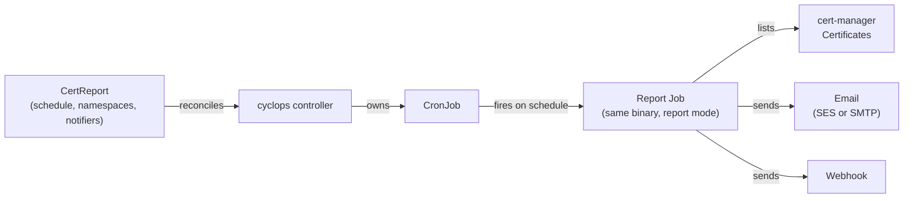

# cyclops

A Kubernetes controller that watches [cert-manager](https://cert-manager.io) `Certificate`
resources and reports certificates that are expired, were never issued, or are overdue for renewal
(past the renewal time cert-manager set for them). Reports go out by email (SES or SMTP) or
webhook.

cyclops only sends a report when something needs attention: a healthy cluster stays quiet. Each
new report configuration gets a one-time welcome message that explains this.

cert-manager renews certificates automatically. cyclops is the backstop for when that renewal
silently fails.

> [!NOTE]
> **Status: in development.** The core reporting logic is written and tested, but cyclops doesn't
> send reports yet. Most of the design is decided. Webhook details, packaging and a few other
> items are still open. See [Status](#status).

## How it works


```mermaid
flowchart LR
    CR["CertReport<br/>(schedule, namespaces, notifiers)"] -->|reconciles| CTRL[cyclops controller]
    CTRL -->|owns| CJ[CronJob]
    CJ -->|fires on schedule| JOB["Report Job<br/>(same binary, report mode)"]
    JOB -->|lists| CM["cert-manager<br/>Certificates"]
    JOB -->|sends| MAIL["Email<br/>(SES or SMTP)"]
    JOB -->|sends| HOOK[Webhook]
```

1. You create a cluster-scoped `CertReport` describing the schedule, which namespaces to cover and who
   to notify.
2. The controller keeps a Kubernetes `CronJob` in sync with it.
3. On schedule, the CronJob runs cyclops in **report mode**: it lists every cert-manager
   `Certificate` and picks out the ones that need attention. If there are any, it sends the report
   to each notifier (`Email` or `Webhook`). If there are none, it sends nothing.
4. When a `CertReport` is first created, cyclops sends a one-time welcome message with the current
   findings. This also checks that delivery works.

For certificates that are due, the report also shows cert-manager's own diagnostics (failed
attempts, ACME state, and the failure reason word for word), so you can see why renewal isn't
happening.

## Status

| Piece | State |
|---|---|
| Architecture decisions | Recorded in [`docs/decisions/`](docs/decisions/README.md); a few still open |
| Deciding which certificates to report (`internal/report`) | Done, tested |
| Converting cert-manager objects (`internal/certmanager`) | Done, tested |
| Listing certificates from the cluster (`internal/certmanager`) | Done, tested (unit + cluster) |
| `CertReport` → `CronJob` reconciliation | Not started |
| Email rendering (`internal/render`) | Done, tested |
| Email sending: SMTP (`internal/email`) | Address/message validation, `NewSMTP`, TLS config and MIME building done, tested; `Send` in progress |
| Email sending: SES, env-based provider selection (`internal/email`) | Tests written, implementation stubbed (`TODO(user)`) |
| Webhook sending | Not started; design open ([ADR 0017](docs/decisions/0017-webhook-notifier.md)) |
| Welcome message | Not started |
| `CertReport` schema | Placeholder |

## Documentation

- [**Design decisions**](docs/decisions/README.md): what's been decided, with pros and cons, and
  what's still open.
- [**Internals**](docs/README.md#internals): how the code works (startup, leader election, the
  report pipeline).

## Development

**Prerequisites:** Go 1.26+, Docker, `kubectl`, and a Kubernetes cluster with cert-manager
installed (for example [kind](https://kind.sigs.k8s.io)). Tool binaries such as `controller-gen`
and `golangci-lint` are downloaded into `bin/` automatically.

```sh
make build        # build bin/manager
make test         # unit tests (envtest)
make lint         # golangci-lint
make run          # run the controller against your current kubeconfig context
make help         # list all targets
```

Cluster validation tests run the report pipeline against a real cluster using the fixtures in
`test/cluster/testdata/`. They need a kind cluster with cert-manager installed, create and delete
their own `cyclops-test-*` namespaces, and refuse to run on any context not named `kind-*`:

```sh
make test-cluster                              # uses the kind-cyclops context
make test-cluster CLUSTER_CONTEXT=kind-other   # or pick another kind cluster
```

After editing `api/v1alpha1/*_types.go` or `+kubebuilder` markers, regenerate CRDs, RBAC and
DeepCopy code:

```sh
make manifests generate
```

## Deploying to a cluster

```sh
export IMG=<registry>/cyclops:<tag>

make docker-build docker-push IMG=$IMG   # build and push the image
make install                             # install the CRDs
make deploy IMG=$IMG                     # deploy the controller
kubectl apply -k config/samples/         # create a sample CertReport
```

If you hit RBAC errors, you may need cluster-admin privileges.

To remove everything:

```sh
kubectl delete -k config/samples/
make undeploy
make uninstall
```

## License

Licensed under the Apache License, Version 2.0. See [LICENSE](LICENSE).
